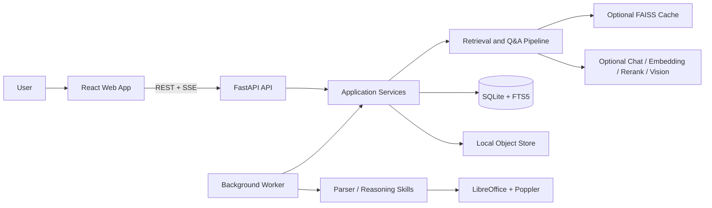

# QBR Insight Agent

QBR Insight Agent is an evidence-first analytics system for Quarterly Business Reviews. It securely imports `.pptx` files, extracts text, tables, notes, and native chart data, combines auditable retrieval with controlled model generation, and links every conclusion back to the original slide and element region.

The system runs in a fully local, deterministic mode **without model credentials**. OpenAI-compatible Chat, Embedding, Rerank, and Vision services can be enabled for stronger semantic planning, hybrid retrieval, answer polishing, and visual enrichment.

## Key Capabilities

- **Secure PPTX ingestion**: streaming uploads, ZIP/OOXML preflight checks, macro and unsafe external-relationship rejection, and file/slide limits.
- **Structured extraction**: text, notes, tables, bounding boxes, DrawingML and ChartEx charts, combination and dual-axis charts, and embedded workbook data.
- **Evidence-first Q&A**: the original question always participates in retrieval; structured chart/table queries, deterministic calculations, citation checks, and insufficient-evidence refusal constrain model generation.
- **Hybrid retrieval**: SQLite FTS5 by default, with optional FAISS vector recall, Reciprocal Rank Fusion, and second-stage semantic reranking.
- **Auditable conversations**: asynchronous answer runs, incremental SSE events, frozen conversation context, structured summaries, model status, warnings, and citation metadata.
- **Human review loop**: claim, correct, and resolve chart review tasks; preserve immutable revisions; rebuild affected chart points and search indexes locally.
- **Multi-workspace security**: `demo`, `password`, and `jwt` authentication modes, workspace RBAC, login rate limiting, secure cookies, and audit events.
- **Complete web workspace**: document library, slide previews, evidence highlighting, streaming Q&A, conversation history, review queue, and run analytics.

## Architecture



The system has two primary workflows:

1. **Ingestion**: upload PPTX → security preflight → worker claims job → native structure and chart-data extraction → slide rendering and optional visual enrichment → persistence to SQLite, FTS5, and the optional vector index.
2. **Question answering**: question analysis and expansion → FTS/vector/structured-data retrieval → coverage checks and deterministic calculations → optional model generation and polishing → numeric allowlist and citation validation → clickable evidence delivered over SSE.

The default deployment runs one API process and one worker against the same SQLite database and object directory. The worker processes ingestion and answer jobs with leases, heartbeats, and bounded retries.

## Quick Start

### Docker Compose

Requirements: Docker Engine and Docker Compose v2.

```bash
cp .env.example .env
docker compose up --build
```

Open <http://localhost:3000>. The API documentation is available at <http://localhost:3000/api/docs>, and the readiness endpoint is <http://localhost:3000/health/ready>.

Compose starts:

- `web`: Nginx-hosted frontend and API reverse proxy;
- `api`: FastAPI service;
- `worker`: standalone background worker;
- `qbr-data`: persistent volume for SQLite, uploaded files, rendered assets, and vector caches.

Stop the services with:

```bash
docker compose down
```

`docker compose down -v` also deletes the persistent data volume. Use it only when the stored data is no longer needed.

### Local Development

Requirements: Python 3.11+ and Node.js 20+. LibreOffice Impress and Poppler are recommended. Without them, the system can still extract native content and provide a fallback preview, but slide rendering fidelity will be reduced.

```bash
python3 -m venv .venv
.venv/bin/pip install -e '.[dev]'
(cd apps/web && npm ci)
cp .env.example .env
```

Terminal 1: start the API with the development worker running in the same process.

```bash
RUN_INLINE_WORKER=true .venv/bin/uvicorn apps.api.main:app --reload --port 8000
```

Terminal 2: start the frontend.

```bash
cd apps/web
npm run dev
```

Open <http://localhost:3000>. Vite proxies `/api` and `/health` to <http://localhost:8000>.

To mirror the production process boundary, set `RUN_INLINE_WORKER=false` in `.env` and run the worker in a separate terminal:

```bash
.venv/bin/qbr-worker
```

## First Run

Local development defaults to `AUTH_MODE=demo` with the `ws_demo/user_demo` identity. No password or model credentials are required.

1. Upload a macro-free `.pptx` from **Document Library**.
2. Wait for the parsing job to reach `ready`; progress is delivered over SSE.
3. Open the document to inspect slides, chart data, and element-level evidence.
4. In **Ask QBR**, create a conversation, select the relevant documents, and ask a question.
5. Click a citation to return to the source slide. Low-confidence charts can be checked in **Reviews**.
6. Use **Analytics** to inspect completion rates, latency, refusals, feedback, and review metrics.

When the LLM is disabled, Q&A uses local retrieval, structured reasoning, and deterministic answers. The system also falls back safely and records a warning when model configuration is incomplete, a call times out, citations are invalid, or generated text introduces unsupported numbers.

## Configuration

All configuration comes from server-side environment variables. Copy [`.env.example`](./.env.example) and change only what you need. Secrets must never use the `VITE_*` prefix and must not be committed to version control.

### Authentication Modes

| Mode | Intended use | Required configuration |
|---|---|---|
| `demo` | Local development | None |
| `password` | Single-entry public demo | `JWT_SECRET`, `PASSWORD_USERNAME`, `PASSWORD_HASH` |
| `jwt` | API and automation integrations | `JWT_SECRET` and a client-side Bearer token |

`AUTH_MODE=demo` is rejected in production. Example password-mode configuration:

```dotenv
APP_ENV=production
AUTH_MODE=password
JWT_SECRET=replace-with-at-least-32-random-bytes
PASSWORD_USERNAME=interviewer
PASSWORD_HASH=replace-with-generated-scrypt-hash
```

Generate a scrypt password hash interactively:

```bash
.venv/bin/python scripts/create_password_hash.py
```

### Chat Models

The server supports OpenAI-compatible Chat Completions:

```dotenv
LLM_ENABLED=true
LLM_PROVIDER=openai-compatible
LLM_BASE_URL=https://provider.example/v1
LLM_API_KEY=server-side-secret
LLM_MODEL=your-chat-model

# Optional role-specific routing; empty values reuse LLM_MODEL.
PLANNER_MODEL=
DEEP_LLM_MODEL=
```

When an external provider is enabled, the user's question, frozen recent conversation context, and retrieved document evidence are sent to that provider. Critical values are still calculated locally, and generated output must pass citation and numeric validation.

### Vector Retrieval and Reranking

Install the optional vector dependencies for local development:

```bash
.venv/bin/pip install -e '.[vector]'
```

```dotenv
RETRIEVAL_STRATEGY=hybrid
EMBEDDING_PROVIDER=openai-compatible
EMBEDDING_BASE_URL=https://provider.example/v1
EMBEDDING_API_KEY=server-side-secret
EMBEDDING_MODEL=your-embedding-model

RERANK_ENABLED=true
RERANK_BASE_URL=https://provider.example/rerank/v1
RERANK_API_KEY=server-side-secret
RERANK_MODEL=your-rerank-model
```

The `chunk_embeddings` table is the source of truth for embeddings. FAISS files are workspace-scoped candidate-retrieval caches that can be rebuilt atomically. The system falls back to FTS when the vector model, dimensions, endpoint, dependencies, or index are unavailable. `EMBEDDING_PROVIDER=hashing` is intended only for offline tests and retrieval ablations.

### Visual Enrichment

```dotenv
VISION_ENABLED=true
VISION_BASE_URL=https://provider.example/v1
VISION_API_KEY=server-side-secret
VISION_MODEL=your-vision-model
VISION_MAX_SLIDES=50
VISION_ENRICH_ALL_SLIDES=false
```

By default, visual enrichment processes only slides that contain image elements. Its output is stored as supplemental evidence with model and confidence metadata; it cannot override exact values extracted from native tables or charts.

See [`.env.example`](./.env.example) for the complete variable list, defaults, and limits. For single-host AWS or Alibaba Cloud deployment, Nginx, systemd, backup, and recovery, see the [cloud deployment runbook](./cloud-deployment-runbook/README.md).

## API

OpenAPI UI: `/api/docs`; schema: `/api/openapi.json`.

| Resource | Main endpoints |
|---|---|
| Health | `GET /health/live`, `GET /health/ready` |
| Authentication | `POST /api/v1/auth/login`, `GET /api/v1/auth/session`, `POST /api/v1/auth/logout` |
| Documents | `POST/GET /api/v1/documents`, document detail/delete/purge, slides, and previews |
| Ingestion jobs | Job detail, cancel, retry, and `GET /api/v1/jobs/{job_id}/events` |
| Conversations and answers | Conversation CRUD, message submission, run status, and `GET /api/v1/runs/{run_id}/events` |
| Reviews and analytics | Review task list/claim/resolve and `GET /api/v1/analytics/summary` |

See [Backend and API Design](./docs/06-backend-api.md) for full request and response contracts, state transitions, and error formats.

## Repository Layout

```text
apps/
  api/                         FastAPI entry point, dependencies, and routes
  worker/                      Background ingestion and answer worker
  web/                         React + TypeScript + Vite SPA
packages/qbr_core/
  application/                 Application services, job lifecycle, and persistence boundaries
  analysis/                    Deterministic answers, calculations, chart/table analysis, and validation
  conversations/               Frozen context and incremental summaries
  documents/                   PPTX parsing and visual enrichment
  foundation/                  Configuration, SQLite, logging, leases, and shared infrastructure
  planning/                    Question analysis, planning, terminology, and language policies
  providers/                   Model adapters
  retrieval/                   FTS, vectors, RRF, reranking, and evidence coverage
  security/                    Authentication, archival, and security policies
  skills/                      Skill Registry
skills/                        Discoverable ParserSkill and ReasoningSkill packages
tests/                         Unit, integration, and end-to-end tests
benchmarks/                    QBR, terminology, query-pipeline, and chart evaluation sets
docs/                          Product, architecture, data, API, security, and testing design
deploy/docker/                 Backend/frontend images and Nginx configuration
cloud-deployment-runbook/      AWS and Alibaba Cloud runbook and templates
```

`QBRService` is the composition root shared by the API, worker, and scripts. Focused application services manage ingestion, answers, persistence, and resource lifecycles, while domain policies implement retrieval, calculation, validation, and refusal behavior. At runtime, the Skill Registry discovers and validates capability packages from trusted `SKILL_PATHS`, then imports them only when needed.

## Testing and Quality Checks

Backend:

```bash
.venv/bin/python skills/extract-ppt-chart-data/scripts/self_test.py
.venv/bin/ruff check apps packages tests
.venv/bin/pytest
```

Frontend:

```bash
cd apps/web
npm run lint
npm test
npm run build
```

The browser end-to-end suite starts a real FastAPI server and inline worker in an isolated temporary data directory:

```bash
cd apps/web
npx playwright install chromium
npm run test:e2e
```

## Evaluation Benchmarks

- **QBR-50**: 50 questions across three documents, evaluating retrieval, numeric accuracy, citations, and refusal behavior.
- **QBR Terms**: regression coverage for 50 management, finance, life insurance, customer, and sales terms.
- **Query Pipeline**: regression coverage for question intent, original-query preservation, expansion, hard constraints, and content-role filtering.
- **Chart Analysis**: structured reasoning and generalization over complex charts.

Examples:

```bash
.venv/bin/python scripts/evaluate_retrieval.py
.venv/bin/python scripts/evaluate_qbr_benchmark.py --retrieval-strategy fts
.venv/bin/python scripts/evaluate_qbr_benchmark.py \
  --retrieval-strategy hybrid \
  --embedding-provider hashing
.venv/bin/pytest -q tests/unit/test_query_pipeline.py
```

Dataset documentation is available under [`benchmarks/`](./benchmarks/). Evaluation output is written to the Git-ignored `benchmark_results/` directory by default.

## Security and Known Boundaries

- Only macro-free `.pptx` files are accepted. External workbooks and remote templates are never fetched.
- The SQLite architecture targets a single-node, single-writer deployment and does not support transparent horizontal scaling. Multi-instance production deployments should migrate to a service database and object store.
- FAISS performs candidate recall only; it cannot replace structured relationships among chart series, categories, axes, units, and values.
- Answers are generated and fully validated before they are incrementally delivered over SSE. Provider tokens are never streamed directly before numeric and citation checks.
- Without a vision model, image-based charts become review candidates only. Even with vision enabled, pixel estimates are never presented as exact values.
- LibreOffice rendering can differ from Microsoft PowerPoint in fonts and layout. The deployment image pins a LibreOffice, Poppler, and Noto CJK font environment to improve reproducibility.
- Chat, Embedding, Rerank, and Vision failures preserve an explicit degraded state. The system never presents a missing capability as a successful result.

See [Security and Governance](./docs/08-security-governance.md) for the full threat model and [Implementation Status](./docs/13-implementation-status.md) for implemented capabilities and intentionally deferred work.

## Documentation

- [Detailed Design Index](./docs/README.md)
- [System Architecture](./docs/02-system-architecture.md)
- [Multimodal PPT Parsing Skill](./docs/03-ppt-parsing-skill.md)
- [SQLite Data and Indexing](./docs/04-data-and-sqlite.md)
- [RAG and Agent Design](./docs/05-rag-and-agent.md)
- [Backend API](./docs/06-backend-api.md)
- [Frontend and UX](./docs/07-frontend-ux.md)
- [Testing and Evaluation](./docs/10-testing-evaluation.md)
- [ADRs, Risks, and Open Questions](./docs/12-decisions-risks.md)
- [Cloud Deployment Runbook](./cloud-deployment-runbook/README.md)
