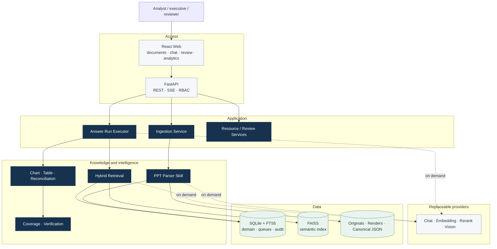
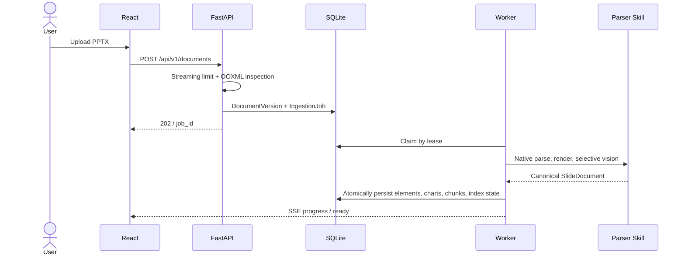
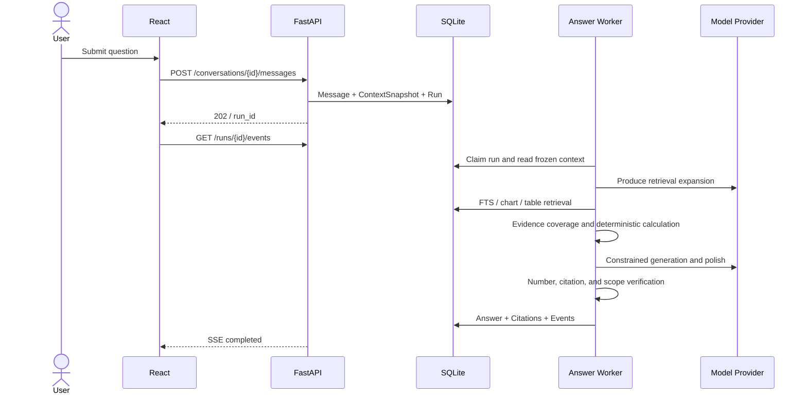
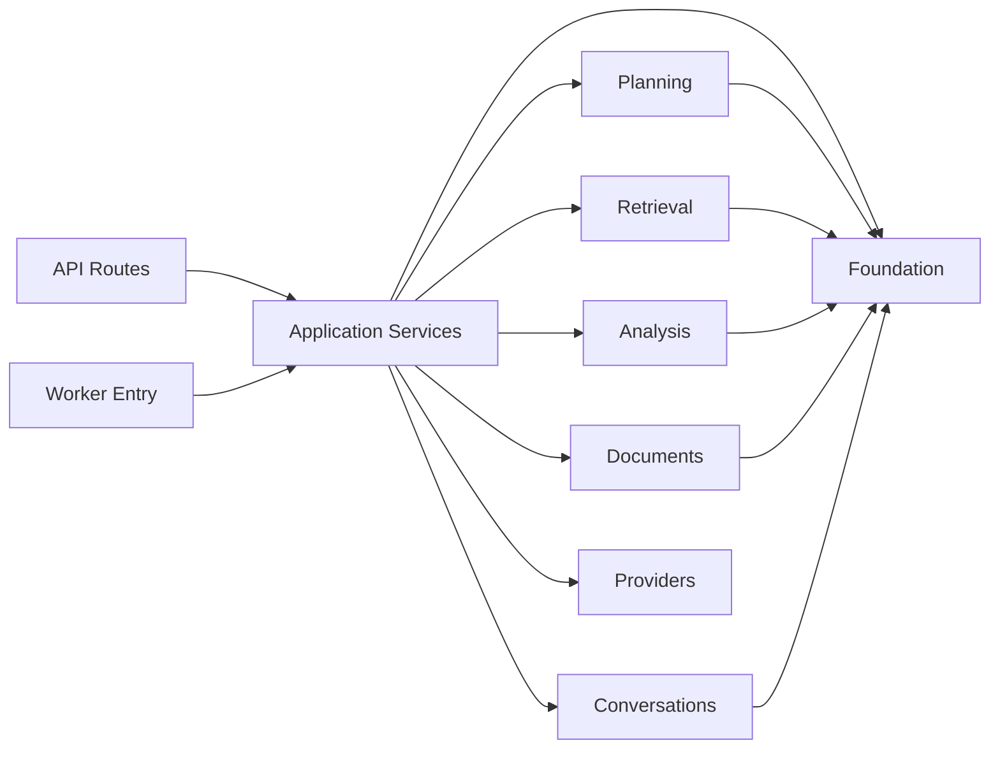

# 02. System Architecture

## 1. Architectural conclusion

The system is a modular, single-node, asynchronous architecture. React owns interaction; FastAPI owns resources and authorization; workers execute ingestion and answer runs; SQLite/FTS5 stores business truth and lexical indexes; FAISS provides a rebuildable semantic index; model providers are adapters.

Single-node deployment is a deliberate fit for the present scale: consistency, operating cost, and recovery remain simple. Application boundaries, domain identifiers, object storage, and retrieval contracts are already separated so infrastructure can evolve without rewriting the product core.

## 2. System context

## 3. Two critical paths

### 3.1 Ingestion

The request path remains short. Durable jobs, leases, heartbeats, and attempts carry long-running work, so worker restart and browser refresh do not erase state.

### 3.2 Evidence-grounded QA

## 4. Dependency direction

Routes do not contain SQL, providers do not own business policy, and analysis is independent of the web layer. `QBRService` is a composition root and compatibility facade; focused services execute the use cases.

## 5. Technology choices

| Concern | Choice | Rationale |
|---|---|---|
| Web | React 19, TypeScript, Vite | Typed SPA suited to streaming and evidence preview |
| API | FastAPI | OpenAPI, dependency injection, SSE, streaming uploads |
| Background work | Durable SQLite queue + worker | Recoverable state with minimal operating surface |
| Domain storage | SQLite WAL | Short transactions, simple backup, portable demonstration |
| Lexical search | FTS5 | Reliable for abbreviations, periods, values, and terms |
| Semantic search | FAISS | Rebuildable index separated from domain truth |
| Agent | LangGraph plus explicit orchestration | Controlled model nodes and visible deterministic boundaries |
| Parsing | python-pptx, OOXML, workbook | Maximum use of exact source-file information |

## 6. Runtime topology

The delivery topology is Nginx, static web assets, FastAPI, a worker, and encrypted persistent storage. API and worker use the same image with different commands. Cloud mappings are EC2/EBS/S3 or ECS/ESSD/OSS without changing application contracts.

## 7. Implementation anchors

- Composition root: `packages/qbr_core/application/service.py`
- Ingestion orchestration: `packages/qbr_core/application/ingestion.py`
- Answer orchestration: `packages/qbr_core/application/answer_runs.py`
- Durable runs: `packages/qbr_core/application/run_store.py`
- Entrypoints: `apps/api/main.py`, `apps/worker/main.py`
