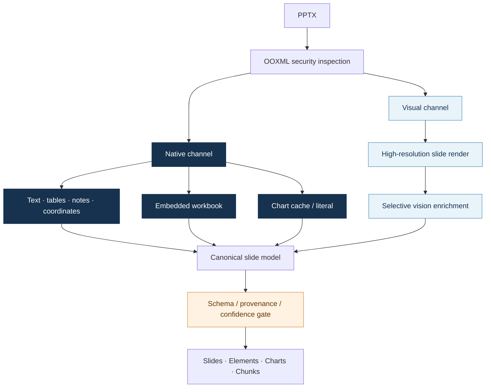
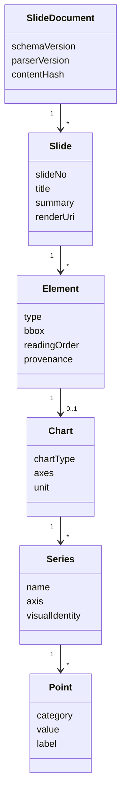

# 03. Multimodal PPT Ingestion and Knowledge Modelling

## 1. Why parsing is a core capability

The most valuable QBR facts live in editable charts, embedded workbooks, tables, notes, grouped shapes, and screenshots. Flattened text loses series, periods, and units. Vision-only extraction discards exact values already present in the file.

The parser therefore has two channels: structure recovers file truth, vision recovers page semantics, and both converge into one canonical model.

## 2. Parsing architecture

## 3. Numeric source precedence

| Priority | Source | Typical use |
|---:|---|---|
| 1 | Embedded workbook | Series, categories, exact values, formula results |
| 2 | OOXML chart cache / literal | Chart values without a workbook |
| 3 | Native tables and data labels | Conditions, matrices, thresholds |
| 4 | Visual observation | Image-only charts, layout, semantic context |

Every fact retains `source_kind`, document version, slide, element, bbox, and confidence metadata. Vision supplements native data; it never silently overwrites it.

## 4. Canonical model

The canonical model decouples parser, retrieval, and QA. A new parser, skill, or model creates a new ParserRun against the immutable file. Successful activation then rebuilds derived indexes through stable identifiers.

## 5. Chart knowledge layer

Beyond chart → series → point persistence, `ChartDataCube` normalizes series, categories, periods, units, and axes. It supports period change, year-over-year pairing, group contribution, stacked composition, waterfall paths, dual-axis isolation, multi-series trends, and table/chart reconciliation. The rules depend on chart structure and question semantics, not deck-specific series names.

## 6. Skill Registry

Parser and table-reasoning capabilities are trusted skill packages. The registry validates manifest, schema, entrypoint, version, and dependencies, and loads only from configured roots. Capabilities are instantiated on demand, so ordinary text questions do not pay the startup cost of table or vision tooling.

## 7. Implementation anchors

- PPT parser: `packages/qbr_core/documents/parser.py`
- Vision enrichment: `packages/qbr_core/documents/vision.py`
- Parsed persistence: `packages/qbr_core/application/persistence.py`
- Chart semantics: `packages/qbr_core/analysis/charts/semantics.py`
- Skill loading: `packages/qbr_core/skills/registry.py`
- Skill package: `skills/extract-ppt-chart-data/`
