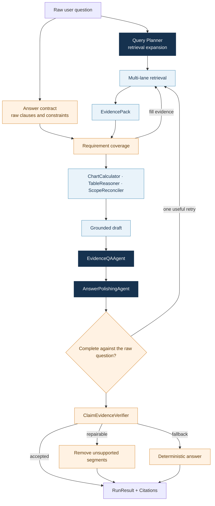

# 04. AI Agent and Reasoning Workflow

## 1. Design objective

The agent is a controlled evidence workflow, not an open-ended autonomous assistant. It has a finite toolset, server-owned document scope, bounded evidence retries, and explicit terminal states. Models handle language and synthesis; code owns authorization, facts, calculations, and acceptance.

## 2. End-to-end workflow

## 3. Planner authority

`QueryPlan` carries the raw question, answer language, explicit period and percentage constraints, document scope, execution profile, and weighted RetrievalQueries. The planning model only expands recall with abbreviations, synonyms, and bilingual terms. Compatibility fields such as `canonical_question` and `task_summary` are derived from the raw question.

This preserves the model's value for language ambiguity without turning its output into a hidden replacement requirement.

## 4. Composable answer contract

The system does not compress a question into one mutually exclusive intent. Each raw clause becomes a requirement with any combination of checks:

| Check | What it establishes |
|---|---|
| `direct_support` | Directly relevant evidence exists |
| `numeric` | Value, period, and unit are available |
| `comparison` | Both comparison sides and relationship are present |
| `attribution` | Drivers or grouped contribution are available |
| `provenance` | The source can be located |
| `decision_criterion` | Current value, threshold, and direction are present |
| `visual_analysis` | The requested chart structure is covered |

“Has the risk breached its limit, and what drives it?” composes numeric, threshold, comparison, and attribution checks instead of requiring a hard-coded question class.

## 5. Deterministic reasoning tools

`ChartCalculator`, `TableReasoner`, and `ScopeReconciler` emit the same `VerifiedCalculation` contract: readable result, structured facts, participating evidence, and scope. Their capabilities include deltas, relative growth, percentage points, period pairing, grouped contribution, thresholds, extrema, conditional filtering, cross-row aggregation, table/chart reconciliation, and high-density chart trends.

Tool output enters the same EvidencePack as retrieved evidence; one calculation cannot erase unresolved parts of a compound question.

## 6. Generation, polish, and verification

The answer model receives numbered evidence and a bounded grounding context. The polishing agent may improve headings and sentence structure, but cannot add numbers or remove citations. The verifier checks numeric allowlists, citation references, chart scope, markdown integrity, and unsupported absolute negatives.

The disposition is accept, local repair, or deterministic fallback. Better prose never changes the fact-admission policy.

## 7. Auditability

Every run persists its query plan, retrieval diagnostics, EvidencePack, calculation facts, verification disposition, provider metadata, warnings, and event stream. A demonstration can drill from one sentence down to the full execution trace.

## 8. Implementation anchors

- Run orchestration: `packages/qbr_core/application/answer_runs.py`
- Planning: `packages/qbr_core/planning/`
- Evidence contract: `packages/qbr_core/retrieval/coverage.py`
- Deterministic answer: `packages/qbr_core/analysis/answering.py`
- Fact verification: `packages/qbr_core/analysis/verification.py`
- Model agents: `packages/qbr_core/providers/llm.py`
