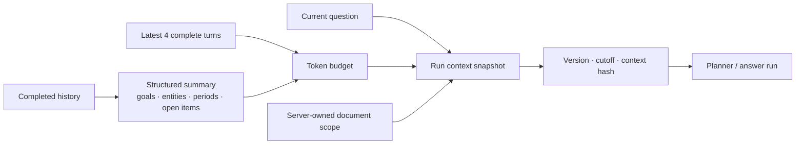
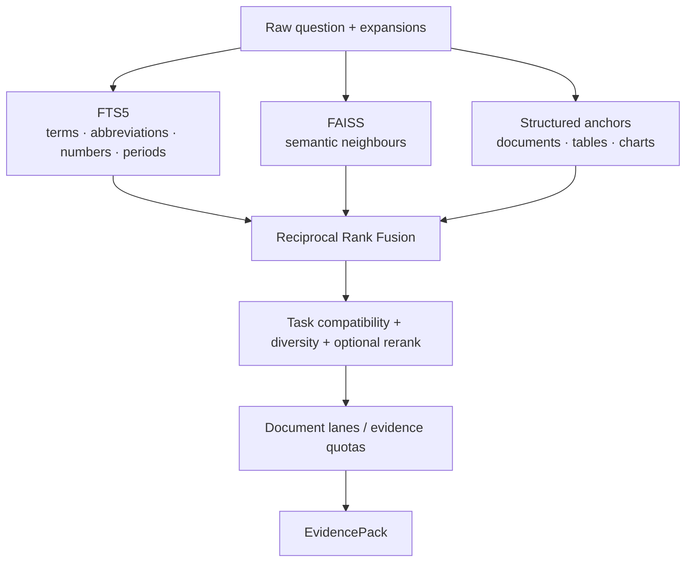

# 05. Context Management and RAG

## 1. Context responsibility

Conversation history resolves references such as “it,” “last quarter,” or “the blue line.” It is not business evidence. Every factual conclusion is retrieved again from the currently authorized documents.

Context is frozen when a question is enqueued, turning asynchronous execution from “read a changing conversation” into “process immutable input.”

The snapshot, user message, and run are created in one transaction. Queueing, retry, worker hand-off, and refresh always read the same version and cannot observe future turns.

## 2. Summary strategy

Older turns are reduced to stable entities, periods, comparison targets, completed work, and open items; recent turns remain verbatim. A deterministic merge establishes the structure before optional model enhancement. Summary failure never blocks question submission.

This is a better fit than unbounded history concatenation: token cost is controlled, references remain visible, and old answers never become new facts.

## 3. Multi-lane retrieval

FTS and vectors solve different problems. FTS is strong for VONB, FY2025, and 15.8%; vector search captures paraphrase. Structured anchors make chart points and table rows retrievable without relying on long-text similarity.

## 4. Fusion and ranking

Scores from different retrievers are not directly comparable. RRF first combines ranks, followed by content-role compatibility, source reliability, diversity selection, and optional semantic reranking. A reranker may reorder candidates but cannot widen workspace or document scope; deterministic order remains valid when the provider is absent.

`retrieval/strategies.py` owns candidate strategy, `retrieval/ranking.py` owns fusion and selection, and `retrieval/evidence.py` owns evidence assembly. This makes FTS-only, vector-only, hybrid, and rerank ablations straightforward.

## 5. Cross-document retrieval

Each target document receives an independent lane and evidence quota before global ranking. One high-similarity deck cannot monopolize a synthesis question. In the real-model matrix, a representative cross-document case expanded from one source deck to all three target decks after this design was introduced.

## 6. EvidencePack

EvidencePack is not a top-k list. It carries normalized evidence atoms and locations, requirement coverage, document and content-role coverage, structured tool facts, numbered grounding context, and retrieval diagnostics. The model receives only the selected evidence; it never receives database or arbitrary-file access.

## 7. Index lifecycle

FTS5 and FAISS are derived indexes. Domain facts live in relational tables and the canonical model. Document activation, review revision, and purge can rebuild indexes by workspace. The FAISS manifest signs active chunks to detect stale caches.

## 8. Implementation anchors

- Context snapshots: `packages/qbr_core/conversations/context.py`
- Conversation summaries: `packages/qbr_core/conversations/summary.py`
- Retrieval engine: `packages/qbr_core/retrieval/engine.py`
- Fusion and ranking: `packages/qbr_core/retrieval/ranking.py`
- EvidencePack: `packages/qbr_core/retrieval/evidence.py`
- Vector index: `packages/qbr_core/retrieval/vector_store.py`
