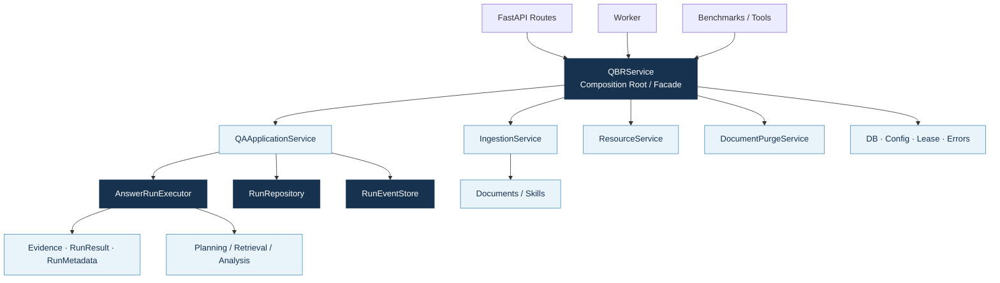
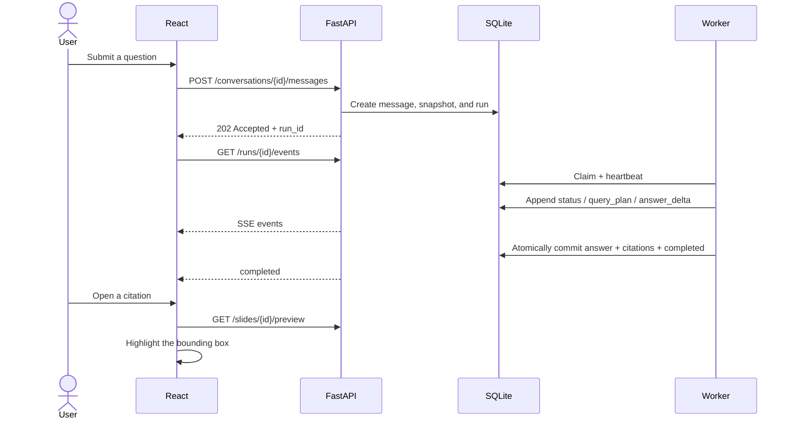
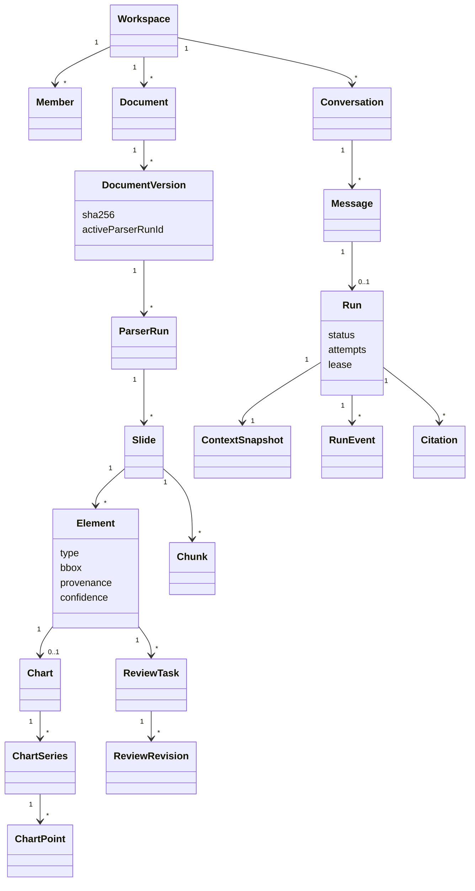
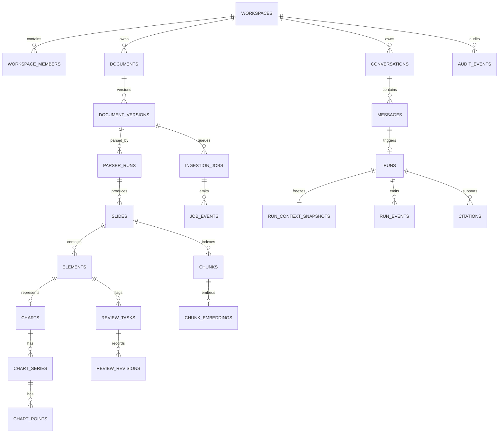

# 06. Modules, APIs, and Data Design

## 1. Application modules

`QBRService` is the shared composition root for the API, worker, and evaluation tools. It assembles the database, skills, retrievers, model providers, and focused application services without turning the facade into a catch-all service.

The split has three practical benefits: orchestration can be tested without HTTP; run-state transitions stay inside the repository; and immutable dataclasses validate data crossing boundaries instead of passing loosely shaped dictionaries through multiple layers.

## 2. Frontend–backend contract

REST handles resources and commands; SSE carries long-running task events. Uploads and questions return a `job_id` or `run_id` immediately. A client can reconnect and resume from `Last-Event-ID`.

### Core APIs

| Capability | Method and path | Response model |
|---|---|---|
| Upload a document | `POST /api/v1/documents` | 202 + document/job |
| Stream ingestion events | `GET /api/v1/jobs/{id}/events` | SSE |
| Create a conversation | `POST /api/v1/conversations` | 201 |
| Submit a question | `POST /api/v1/conversations/{id}/messages` | 202 + run |
| Stream answer events | `GET /api/v1/runs/{id}/events` | resumable SSE |
| Preview a slide | `GET /api/v1/slides/{id}/preview` | private cached asset |
| Resolve a review task | `POST /api/v1/review-tasks/{id}/resolve` | revision |
| Purge a document | `DELETE /api/v1/documents/{id}/purge` | deletion summary |

Question submission is idempotent through `client_message_id`. Routes derive workspace and user scope from the authenticated principal; the client cannot widen that scope through request parameters.

## 3. Domain model

Separating `DocumentVersion` from `ParserRun` is a key modeling decision. The same immutable file can be reprocessed with a new parser, skill, or model; a parser run becomes active only after its data and indexes have been committed successfully.

## 4. Entity–relationship model

Charts use relational `chart → series → point` records rather than a single JSON blob. This supports SQL queries and deterministic calculations by period, unit, and series. JSON is reserved for extensible metadata; FTS and FAISS remain rebuildable indexes.

## 5. Consistency strategy

- SQLite runs in WAL mode with `busy_timeout` and short write transactions; model and embedding calls happen outside transactions.
- Run completion writes the answer, citations, event, and terminal state in one transaction.
- Workers use leases and heartbeats, while the repository validates every state transition.
- Purge operates on a workspace/document boundary and removes relational data, FTS entries, embeddings, objects, and caches together.
- Structured settings are projected into immutable domain views for storage, models, retrieval, conversations, and workers.

## 6. Implementation anchors

- Database: `packages/qbr_core/foundation/database.py`
- Application contracts: `packages/qbr_core/application/contracts.py`
- Run repository: `packages/qbr_core/application/run_store.py`
- API routes: `apps/api/routes/`
- Web API client: `apps/web/src/api.ts`
