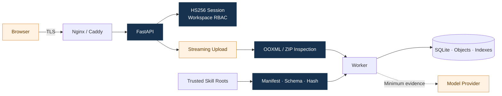
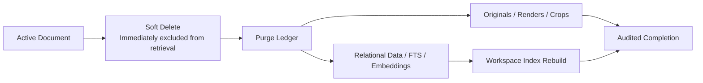
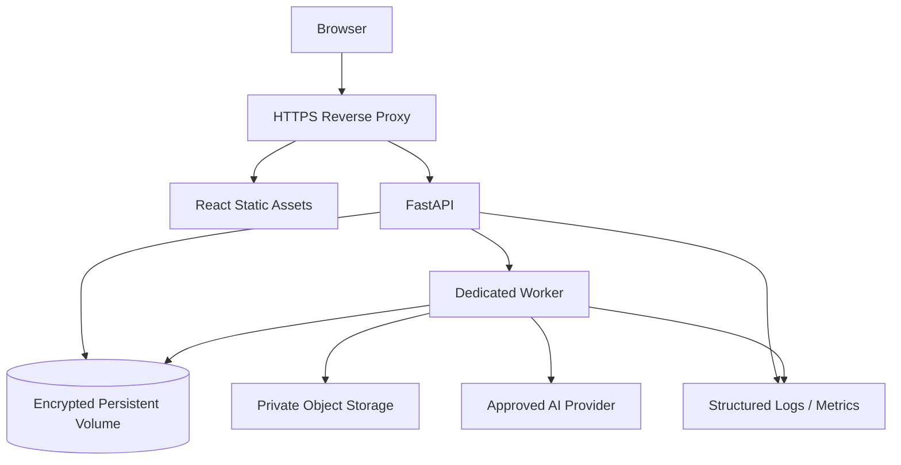

# 07. Security, Operations, and Evolution

## 1. Trust boundaries

The system treats browser input, uploaded files, document content, external models, and dynamic capability packages as separate trust levels. Controls are enforced at upload, identity, scope, tool, and output boundaries rather than relying on prompts.

## 2. Authentication and authorization

- Password mode uses scrypt verification and issues a short-lived HS256 session in an HttpOnly, SameSite=Strict cookie.
- Production cookies use `Secure`; login checks `Origin` and applies combined user/IP rate limiting.
- The server resolves workspace, user, and role from the session principal, and every resource query is rebound to that workspace.
- Permissions are checked by capabilities such as `ask`, `document:write`, `document:purge`, `review:write`, and `analytics:read`.
- Login, logout, upload, deletion, review, and configuration actions produce audit events.

## 3. File and content security

Uploads are streamed in 1 MiB chunks into a controlled temporary directory with size enforcement during transfer. Before parsing, the service checks ZIP path traversal, macros, executable members, compression ratios, external relationships, and OOXML structure. Only `.pptx` is accepted, and external templates or workbooks are never fetched automatically.

Document content is always data. Instructions embedded in text, notes, or images cannot change the system prompt, workspace, tool parameters, or provider configuration. The model has no shell, arbitrary HTTP, arbitrary SQL, or database-write tool.

## 4. Output and evidence security

- Answers may cite only evidence identifiers allocated to the current run; the server resolves them back to authorized slides and preview URLs.
- Numeric allowlists, citation sets, and chart scope are validated after generation.
- Markdown is rendered through controlled components, and previews are served by authenticated APIs.
- A retrieval miss is not rewritten as “the document does not contain it”; conclusions require direct evidence.

## 5. Data lifecycle

Soft deletion first removes the document from the product surface and retrieval scope; purge then performs physical removal. The operation is ledgered, counted, and safely repeatable. FAISS is rebuilt from the remaining active chunks.

## 6. Deployment topology

Docker Compose supports local and demonstration deployments. The AWS mapping uses EC2, EBS, and S3; the Alibaba Cloud mapping uses ECS, ESSD, and OSS. API and worker share an image but run as separate processes for independent restart and observability. SQLite uses a single-writer topology, backed up through the online backup API and volume snapshots.

## 7. Graceful degradation and recovery

Providers are configured separately for chat, embeddings, reranking, and vision:

- if chat is unavailable, the system can still return local evidence and deterministic calculations;
- if vectors are unavailable, FTS and structured anchors remain active;
- if reranking is unavailable, RRF order is preserved;
- if vision is unavailable, native PowerPoint content is still processed;
- if a worker stops, the task is reclaimed after its lease expires.

Each fallback is recorded as a structured warning and run metadata, preserving product continuity while making the execution path observable.

## 8. Evolution path

The current architecture optimizes consistency and operability for a single-node delivery. As scale grows, upper-layer contracts remain stable while infrastructure is replaced in order: SQLite → PostgreSQL, database queue → dedicated message broker, local object directory → S3/OSS, and FAISS → managed vector search. Migration is triggered by active data volume, sustained write concurrency, recovery objectives, and replica requirements—not by microservice aesthetics.

## 9. Implementation anchors

- Authentication: `packages/qbr_core/security/authentication.py`
- Archive inspection: `packages/qbr_core/security/archive.py`
- Permission boundary: `apps/api/dependencies.py`
- Document purge: `packages/qbr_core/application/purge.py`
- Deployment assets: `deploy/docker/`, `cloud-deployment-runbook/`
