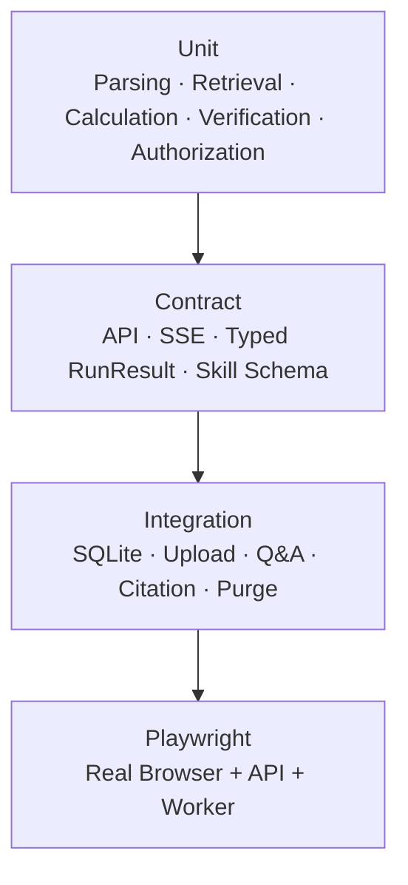
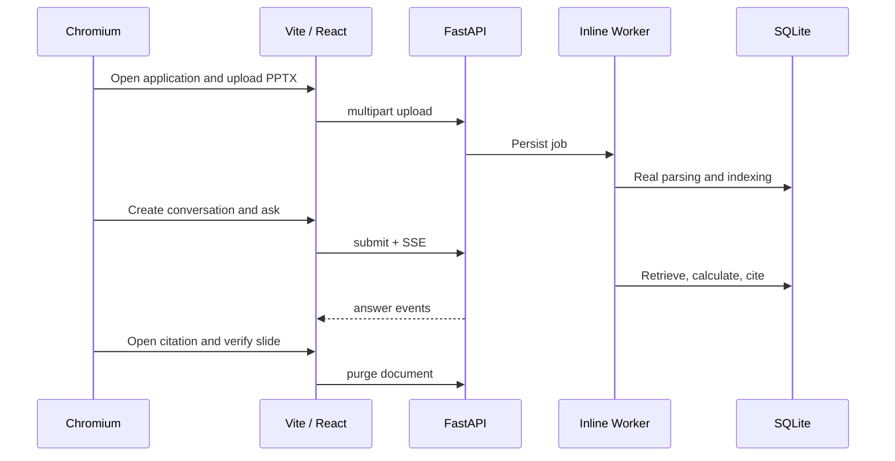

# 08. System Test Report

## 1. Validation summary

Code has been validated across backend, frontend, and real-browser paths. The suite concentrates on the boundaries that are hardest to reproduce manually: document versions, task leases, SSE recovery, context snapshots, complex chart calculations, citations, and complete deletion.

| Check | Measured result |
|---|---:|
| Python unit, integration, and API tests | 203 / 203 passed |
| Backend statement coverage | 88% |
| Ruff | passed |
| TypeScript project check | passed |
| Vitest | 7 files, 14 / 14 passed |
| Vite production build | passed |
| Playwright | 6 / 6 passed |

Execution date: 2026-08-13. The full backend suite completed in approximately 49 seconds; the browser suite took approximately one minute.

## 2. Test pyramid



### Unit and property boundaries

- QueryPlan preservation of the raw question, periods, and explicit constraints;
- RRF, vector-index lifecycle, and cross-document lanes;
- chart period changes, grouped contribution, dual axes, and cross-source reconciliation;
- table conditions, thresholds, extrema, and aggregation;
- numeric, citation, chart-scope, and absolute-negative verification;
- context snapshots, summary merging, and future-turn isolation;
- workspace/user scope and production authentication settings;
- leases, retries, state transitions, and purge completeness.

### Architectural fitness tests

`test_architecture.py` goes beyond return values. It checks composition-root wiring, the absence of mixin inheritance in `QBRService`, route/service boundaries, file-size constraints, and user-level conversation isolation. The architecture rules therefore live in CI rather than only in design documents.

## 3. Real full-stack validation



The primary Playwright scenario starts an isolated FastAPI server, inline worker, temporary database, and real frontend. It executes upload, parsing, question submission, SSE, citation preview, and purge end to end. Additional cases cover keyboard behavior, queued answers, conversation history, run analytics, and anonymous login.

During this run, an external reranker connection failure triggered the deterministic-order fallback while the full user journey still passed—an effective exercise of provider degradation in a real stack.

## 4. Coverage highlights

| Module | Coverage |
|---|---:|
| Application contracts | 97% |
| Answer run executor | 95% |
| QBRService composition root | 96% |
| Chart semantics | 99% |
| Chart calculation | 92% |
| Claim verification | 95% |
| Evidence coverage | 93% |
| Retrieval ranking | 100% |
| Settings domain objects | 96% |

These are the architectural joints of the system: cross-layer contracts, the answer state machine, deterministic reasoning, quality controls, and retrieval ordering.

## 5. Commands

```bash
.venv/bin/ruff check apps packages tests
.venv/bin/pytest --cov=apps --cov=packages --cov-report=term-missing
cd apps/web && npm run lint && npm test && npm run build
cd apps/web && npm run test:e2e
```

## 6. Test assets

- Backend tests: `tests/unit/`, `tests/integration/`
- Browser tests: `apps/web/e2e/`
- PPT fixtures: `tests/fixtures/`
- Benchmarks: `benchmarks/`
- Case-level results: `benchmark_results/`
